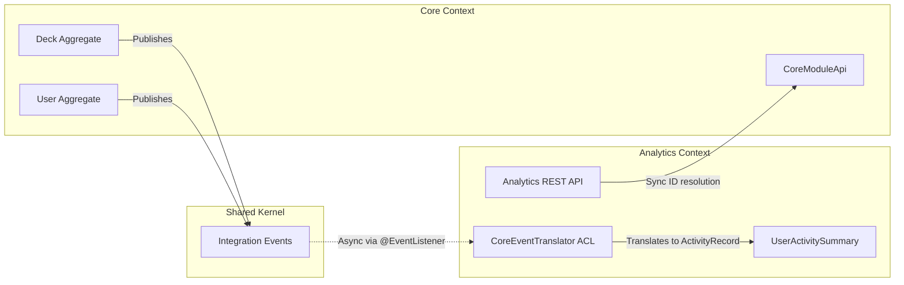

# ADR: Bounded Context Boundaries

## Status

Accepted

## Context

The Flashcard API system, after four labs of evolution, is a layered monolith with CQS and async event-driven activity logging. All modules share one flat namespace and can freely reference each other's internals. Changes in one area risk cascading into unrelated parts of the system.

The lab requires splitting the system into isolated modules (bounded contexts) within a single deployment artifact — a modular monolith.

## Decision

We define **two bounded contexts**:

### 1. Core (Flashcard)
All existing business logic — users, decks, cards, authentication, and activity logging. This is the upstream context that owns the primary data and publishes integration events after business operations.

Core Aggregates: `User`, `Deck` (with `Card` entity).

### 2. Analytics
A new downstream context that consumes integration events from Core and builds aggregated read-only projections (user activity summaries: total decks, total cards, total actions, last activity timestamp). It has its own domain model, its own persistence (`user_activity_summary` table), and its own REST API.

Analytics Aggregate: `UserActivitySummary`.

### Architecture Diagram

### Why Core + Analytics?

| Criterion | Rationale |
|---|---|
| **Different responsibilities** | Core manages CRUD operations on flashcards; Analytics aggregates statistics. These are fundamentally different concerns. |
| **Different data models** | Core works with `Deck`, `Card`, `User`. Analytics works with `UserActivitySummary` — an aggregated projection, not a copy of Core's entities. |
| **Different rate of change** | Core changes with business requirements (new card types, study modes). Analytics evolves independently (new metrics, dashboards). |
| **Natural event boundary** | Core already publishes domain events (from Lab 4). Analytics naturally consumes them — no forced coupling. |
| **Read-only consumer** | Analytics never modifies Core data. It only reacts to events and builds its own projections. This makes eventual consistency acceptable. |

### Alternatives Considered

1. **Core + Notification module** — rejected because notification is a thin side-effect handler (send email), not a domain with its own model. It doesn't demonstrate ACL or projections well.

2. **Three modules (Core + ActivityLog + Analytics)** — rejected because ActivityLog is an audit trail closely tied to core operations. Extracting it adds complexity without demonstrating new concepts beyond what Analytics already covers.

3. **User + Flashcard + Analytics** — rejected because User and Flashcard are tightly coupled in the current design (deck ownership, access control). Splitting them would require significant refactoring with artificial boundaries.

## Communication

- **Core → Analytics**: Asynchronous via Spring Application Events with `@Async` execution. Core publishes integration events (e.g., `DeckCreated`, `CardAdded`). Analytics subscribes and processes them independently.

- **Analytics → Core**: Synchronous via Core's public contract API (`CoreModuleApi`). Used only for user identity resolution in the REST controller.

- **Integration Events**: Defined in the shared kernel (`com.flashcard.shared.event`). These are the public contract between modules — immutable records named in past tense.

## ACL (Anti-Corruption Layer)

Analytics uses `CoreEventTranslator` to translate shared integration events into its internal `ActivityRecord` model. If Core renames a field (e.g., `ownerId` → `creatorId`), only the translator changes — analytics domain logic stays untouched.

## Consistency

| Scope | Consistency Level | Rationale |
|---|---|---|
| Within Core (single command handler) | **Strong** | One DB transaction per operation. Invariants checked before commit. |
| Within Analytics (single event handler) | **Strong** | One DB transaction per projection update. |
| Core → Analytics (cross-module) | **Eventual** | Events processed asynchronously. Analytics projections may lag behind Core by milliseconds to seconds. Acceptable because analytics data is not real-time critical. |

## Consequences

- **Positive**: Clear module boundaries, independent evolution, demonstrated ACL pattern, natural event-driven communication
- **Negative**: Slight code duplication (shared events), eventual consistency requires understanding, more classes than a flat monolith
- **Migration path**: If Analytics needs independent scaling, it can be extracted into a separate microservice — the boundaries are already defined, communication is already event-based
